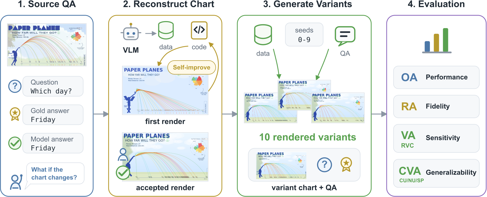

# Chartographer: Counterfactual Chart Generation for Evaluating Vision-Language Models

Authors: Yifan Jiang, Dae Yon Hwang, Jesse C. Cresswell, Freda Shi

📄 [Paper](https://arxiv.org/abs/2605.27311) | 🤗 [Dataset](https://huggingface.co/datasets/1fanj/Chartographer)

## Overview

Chartographer is a counterfactual chart generation pipeline for evaluating whether vision-language models answer chart questions through visual reasoning rather than shortcuts or prior familiarity with a chart.

It converts chart QA examples into counterfactual chart-question families: the original chart, a base reconstruction, and seed-controlled counterfactual variants whose answers are recomputed with executable QA logic.



## Installation

Python 3.10+ is recommended.

```bash
python -m venv .venv
source .venv/bin/activate
pip install -r requirements.txt
```

Set API keys for the providers you plan to use:

```bash
export OPENAI_API_KEY=your_api_key_here
export ANTHROPIC_API_KEY=your_api_key_here
```

For local Hugging Face VLMs, install any hardware-specific packages separately. To prefer local model weights, set:

```bash
export CHARTOGRAPHER_MODEL_WEIGHTS_DIR=/path/to/model-weights
```

## Configure Data

Datasets are configured with a JSON file. Set `CHARTOGRAPHER_DATASETS_FILE` before running Chartographer. See [examples/datasets.example.json](examples/datasets.example.json) for the datasets used in the paper and templates for custom datasets.

Minimal local dataset config:

```json
{
  "datasets": {
    "my_dataset": {
      "local_file_template": "{repo_root}/data/my_dataset/{split}.json",
      "local_dir": "my_dataset",
      "question_col": "question",
      "image_col": "image",
      "answer_col": "answer"
    }
  }
}
```

```bash
export CHARTOGRAPHER_DATASETS_FILE=/path/to/datasets.json
```

For datasets with reconstruction or counterfactual variants, set `variant_col` and `family_id_col` in the config. Datasets exported by Chartographer include those fields automatically.

## Run The Pipeline

Use the `make` targets for the standard workflow. `RECONSTRUCTION_MODEL` is used for chart reconstruction and QA regeneration. `PREDICTION_MODEL` is the VLM being evaluated. `JUDGE_MODEL` checks prediction correctness.

```bash
make reconstruction-workflow DATASET=my_dataset SPLIT=dev RECONSTRUCTION_MODEL=reconstruction-model REVISION_ROUNDS=2
make qa-workflow DATASET=my_dataset SPLIT=dev RECONSTRUCTION_MODEL=reconstruction-model SEED=0
make seed-workflow DATASET=my_dataset SPLIT=dev SEED_START=0 SEED_END=9
```

`REVISION_ROUNDS=N` is optional on `reconstruction-workflow`. It runs N self-refinement turns: diagnose the current render, revise the reconstruction, and render it again. The last revision becomes the active `reconstruction`, temporary revision files are cleaned, and the files needed by QA/export are rebuilt from the promoted reconstruction.

Export the original chart, base reconstruction, and seed-controlled counterfactual variants as a local evaluation dataset:

```bash
make export-family-dataset DATASET=my_dataset SPLIT=dev OUTPUT_DATASET=my_dataset_families FAMILY_SEEDS=0-9
export CHARTOGRAPHER_DATASETS_FILE=$PWD/data/my_dataset_families/datasets.json
```

Run prediction and evaluation on the exported family dataset:

```bash
make prediction-workflow DATASET=my_dataset_families SPLIT=dev PREDICTION_MODEL=prediction-model JUDGE_MODEL=judge-model
```

Use `make help` for individual steps. See [docs/workflow.md](docs/workflow.md) for direct `python -m ...` commands and output locations.

## Repository Layout

```text
src/clients/                  API and local VLM clients
src/common/                   dataset, answer, and prediction I/O utilities
src/config/                   model aliases and task prompts
src/pipeline/reconstruction/  chart reconstruction and counterfactual rendering
src/pipeline/qa/              QA regeneration and execution
src/pipeline/datasets/        chart-question family dataset export
src/pipeline/prediction/      VLM prediction, evaluation, and visualization
```

Generated outputs are written under `results/`; local generated datasets are written under `data/`.

## Citation

If you use Chartographer, please cite the [paper](https://arxiv.org/abs/2605.27311):

```bibtex
@inproceedings{jiang2026chartographer,
  title = {Chartographer: Counterfactual Chart Generation for Evaluating Vision-Language Models},
  author = {Jiang, Yifan and Hwang, Dae Yon and Cresswell, Jesse C. and Shi, Freda},
  booktitle = {Proceedings of the 2026 Conference on Empirical Methods in Natural Language Processing},
  year = {2026},
  publisher = {Association for Computational Linguistics},
  url = {https://arxiv.org/abs/2605.27311}
}
```

## License

See [LICENSE](LICENSE).
